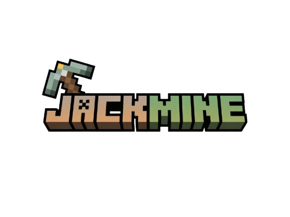

# JackMine - Servidor de Minecraft

<div align="center">
  
  
  <p><strong>Seu novo servidor favorito de Minecraft com os melhores kits e diversão garantida!</strong></p>
  
  [](https://www.instagram.com/jackmineserver/)
  [](https://jackmine.com)
  [](https://jackmine.com)
</div>

## 📋 Sobre o Projeto

JackMine é um servidor de Minecraft moderno e amigável que oferece uma experiência única para jogadores. O site foi desenvolvido para proporcionar aos usuários fácil acesso a informações sobre o servidor, sistema de assinaturas e atualizações.

### 🎮 Características do Servidor

- **Kits Exclusivos:** Desbloqueie kits com itens raros para sua jornada
- **Sistema de Assinaturas:** Escolha entre planos FREE, VIP e TOP
- **Comunidade Ativa:** Faça parte de um ambiente amigável e seguro
- **Suporte Técnico:** Equipe sempre disponível para ajudar

### 🌟 Recursos do Site

- Design moderno e responsivo
- Sistema de pagamento integrado com Stripe
- Verificação de status do servidor em tempo real
- Página de assinaturas com detalhes sobre cada plano
- Processo simplificado de checkout

## 🛠️ Tecnologias Utilizadas

O projeto foi desenvolvido utilizando as seguintes tecnologias:

- **Frontend:**
  - React.js
  - TypeScript
  - TailwindCSS
  - React Router
  - React Query
  - shadcn/ui (componentes)

- **Backend:**
  - Supabase (Funções Edge)
  - Stripe API (processamento de pagamentos)

- **DevOps:**
  - Vite (build e desenvolvimento)
  - npm (gerenciamento de pacotes)
  - Git (controle de versão)

## 📂 Estrutura do Projeto

```
jackmine/
├── public/                  # Arquivos estáticos
│   └── logo.png             # Logo do JackMine
├── src/                     # Código fonte
│   ├── components/          # Componentes React reutilizáveis
│   │   ├── Footer.tsx       # Rodapé do site
│   │   ├── Layout.tsx       # Layout principal
│   │   ├── Navbar.tsx       # Barra de navegação
│   │   └── PlayerCounter.tsx # Contador de jogadores online
│   ├── hooks/               # React hooks personalizados
│   ├── integrations/        # Integrações com serviços externos
│   │   └── supabase/        # Configuração do Supabase
│   ├── lib/                 # Bibliotecas e utilitários
│   ├── pages/               # Páginas do site
│   │   ├── CheckoutPage.tsx        # Página de finalização de compra
│   │   ├── HomePage.tsx            # Página inicial
│   │   ├── NotFound.tsx            # Página 404
│   │   ├── PaymentSimulatedPage.tsx # Página de simulação de pagamento
│   │   ├── PaymentSuccessPage.tsx  # Página de sucesso de pagamento
│   │   └── SubscriptionsPage.tsx   # Página de assinaturas
│   ├── services/            # Serviços e APIs
│   │   ├── minecraftService.ts # Serviço para verificar status do servidor
│   │   └── stripeService.ts # Serviço de integração com o Stripe
│   ├── App.tsx              # Componente principal com rotas
│   └── main.tsx             # Ponto de entrada da aplicação
├── supabase/                # Funções do Supabase
│   └── functions/
│       └── create-checkout/ # Função para criar sessão de checkout
├── .gitignore               # Arquivos ignorados pelo Git
├── package.json             # Dependências e scripts
├── README.md                # Documentação do projeto
└── tsconfig.json            # Configuração do TypeScript
```

## 💻 Como Executar o Projeto

### Pré-requisitos

- Node.js (v14 ou superior)
- npm ou yarn
- Git

### Passos para Execução

1. **Clone o repositório:**
   ```bash
   git clone https://github.com/seuusuario/jackmine.git
   cd jackmine
   ```

2. **Instale as dependências:**
   ```bash
   npm install
   # ou
   yarn install
   ```

3. **Configure as variáveis de ambiente:**
   Crie um arquivo `.env` na raiz do projeto com as seguintes variáveis:
   ```
   VITE_SUPABASE_URL=sua_url_do_supabase
   VITE_SUPABASE_ANON_KEY=sua_chave_anon_do_supabase
   VITE_MINECRAFT_SERVER=190.102.40.99:26040
   ```

4. **Execute o projeto em modo de desenvolvimento:**
   ```bash
   npm run dev
   # ou
   yarn dev
   ```

5. **Acesse o projeto no navegador:**
   O site estará disponível em `http://localhost:5173`

## 🚀 Deploy

Para fazer o deploy do projeto em produção:

1. **Construa a aplicação:**
   ```bash
   npm run build
   # ou
   yarn build
   ```

2. **Deploy na plataforma de sua escolha:**
   Os arquivos de build estarão na pasta `dist` e podem ser hospedados em serviços como Netlify, Vercel, ou qualquer outro serviço de hospedagem.

## 📱 Responsividade

O site é totalmente responsivo e adaptado para:
- Desktops
- Tablets
- Smartphones

## 🔒 Segurança

- Integração segura com Stripe para processamento de pagamentos
- Validação de formulários no cliente e servidor
- Proteção contra ataques comuns

## 👥 Contribuição

Contribuições são sempre bem-vindas! Para contribuir:

1. Faça um fork do projeto
2. Crie uma branch para sua feature (`git checkout -b feature/nova-feature`)
3. Commit suas mudanças (`git commit -m 'Adiciona nova feature'`)
4. Push para a branch (`git push origin feature/nova-feature`)
5. Abra um Pull Request

## 📞 Contato e Suporte

- **Email:** contato@jackmine.com
- **Discord:** [Servidor Discord JackMine](https://discord.gg/jackmine)
- **Instagram:** [@jackmineserver](https://www.instagram.com/jackmineserver/)

## 📄 Licença

Este projeto está licenciado sob a [Licença MIT](LICENSE).

---

<div align="center">
  <p>© 2023 JackMine. Todos os direitos reservados.</p>
  <p>Este site não é afiliado à Mojang Studios ou Microsoft.</p>
</div>
